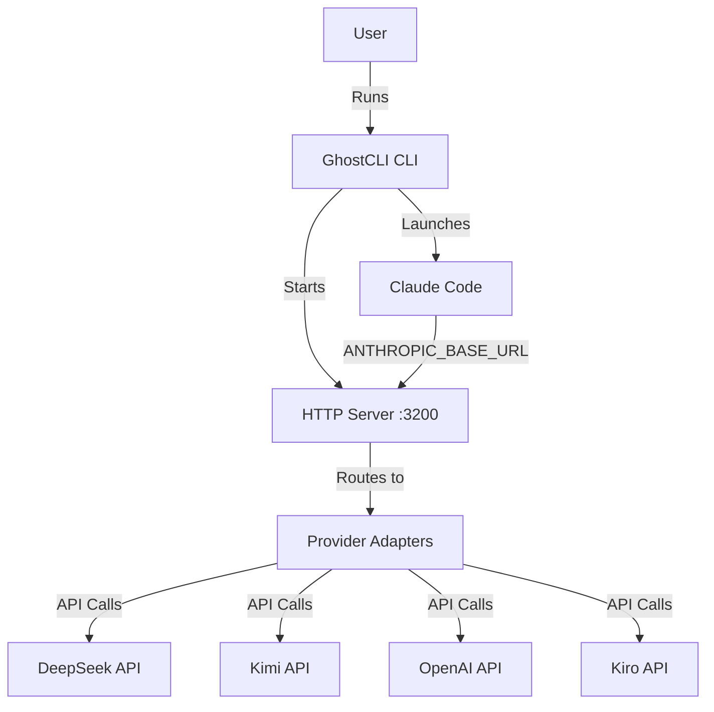
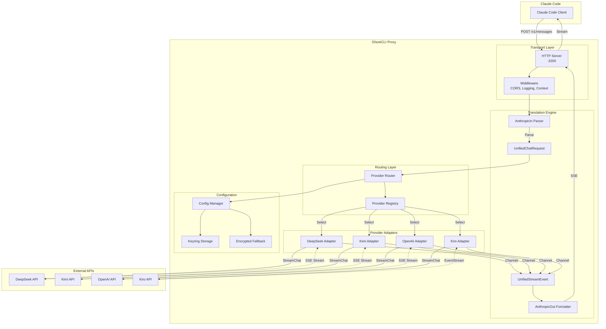
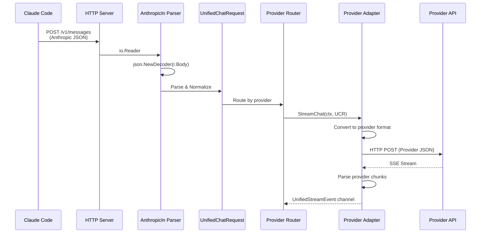
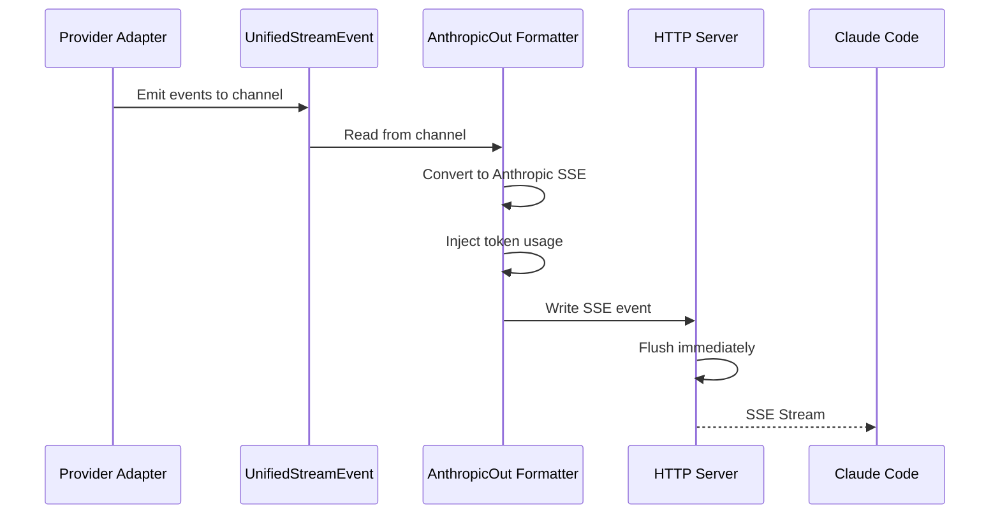

# GhostCLI Proxy - Technical Design Document

## Overview

GhostCLI is a high-performance, Go-based proxy server that enables Claude Code to communicate with alternative LLM providers (DeepSeek, Kimi, OpenAI, Kiro) through a unified translation layer. The system intercepts Anthropic Messages API requests, translates them through an internal unified protocol, routes them to provider-specific adapters, and streams responses back in Anthropic-compatible SSE format.

### Key Design Goals

- **Zero-Buffer Streaming**: Achieve sub-5ms translation latency with immediate SSE flushing
- **Pattern-First Architecture**: Group providers into reusable families (OpenAI-Compat, Anthropic-Native, AWS/EventStream)
- **SOLID Principles**: Dependency injection, interface-based design, single responsibility
- **Cross-Platform**: Single static binary for Windows, macOS (Intel/ARM), and Linux
- **Security-First**: OS-native keyring storage with encrypted fallback
- **Developer Experience**: Interactive CLI setup with zero-config Claude Code integration

### System Context




## Architecture

### High-Level System Architecture



### Modular Folder Structure

Following SOLID principles and Go best practices:

```
ghostcli/
├── cmd/
│   └── ghost/                    # CLI entry point
│       ├── main.go              # Bootstrap, flag parsing
│       ├── setup.go             # Interactive onboarding
│       └── version.go           # Version command
│
├── internal/
│   ├── app/                     # Application orchestration
│   │   ├── app.go              # Main app struct, DI container
│   │   └── lifecycle.go        # Startup/shutdown logic
│   │
│   ├── api/                     # HTTP transport layer
│   │   ├── server.go           # HTTP server setup
│   │   ├── handlers.go         # Request handlers
│   │   ├── middleware.go       # CORS, logging, context
│   │   └── health.go           # Health check endpoint
│   │
│   ├── engine/                  # Translation engine core
│   │   ├── protocol/           # Unified protocol definitions
│   │   │   ├── types.go       # UnifiedChatRequest, UnifiedStreamEvent
│   │   │   └── constants.go   # Event types, model mappings
│   │   ├── translator/         # Bidirectional translators
│   │   │   ├── anthropic_in.go    # Anthropic → Unified
│   │   │   └── anthropic_out.go   # Unified → Anthropic SSE
│   │   └── pipeline/           # Streaming pipeline
│   │       ├── stream.go      # Stream orchestration
│   │       └── usage.go       # Token usage normalization
│   │
│   ├── providers/              # Provider integration layer
│   │   ├── interface.go       # Provider interface definition
│   │   ├── registry.go        # Provider registry
│   │   ├── factory.go         # Provider factory (DI)
│   │   ├── base/              # Shared adapter logic
│   │   │   ├── openai_base.go    # OpenAI-compatible base
│   │   │   ├── anthropic_base.go # Anthropic-native base
│   │   │   └── aws_base.go       # AWS EventStream base
│   │   ├── deepseek/          # DeepSeek adapter
│   │   │   ├── adapter.go
│   │   │   └── config.go
│   │   ├── kimi/              # Kimi adapter
│   │   ├── openai/            # OpenAI adapter
│   │   └── kiro/              # Kiro adapter
│   │
│   ├── config/                 # Configuration management
│   │   ├── config.go          # Config struct and loading
│   │   ├── storage.go         # Keyring + encrypted storage
│   │   └── validation.go      # API key validation
│   │
│   └── telemetry/             # Observability
│       ├── logger.go          # Structured logging (slog)
│       └── metrics.go         # Performance metrics
│
├── pkg/                        # Public reusable packages
│   └── models/                # Shared model definitions
│
└── docs/                       # Documentation
```

### Layer Responsibilities

**CLI Layer (`cmd/ghost/`)**
- Parse command-line flags and environment variables
- Interactive setup wizard for first-run experience
- Bootstrap application with dependency injection
- Graceful shutdown signal handling

**Application Layer (`internal/app/`)**
- Orchestrate component initialization
- Manage application lifecycle (startup, shutdown)
- Dependency injection container
- Configuration loading and validation

**Transport Layer (`internal/api/`)**
- HTTP server setup and routing
- Request/response handling
- Middleware (CORS, logging, context propagation)
- Health check endpoint

**Engine Layer (`internal/engine/`)**
- Unified protocol definitions (UnifiedChatRequest, UnifiedStreamEvent)
- Bidirectional translation (Anthropic ↔ Unified)
- Streaming pipeline orchestration
- Token usage normalization

**Provider Layer (`internal/providers/`)**
- Provider interface definition
- Provider registry and factory
- Pattern-based adapter implementations
- Provider-specific API communication

**Configuration Layer (`internal/config/`)**
- Configuration file parsing (YAML/JSON)
- Secure API key storage (OS keyring + encrypted fallback)
- API key validation
- Model name mapping

**Telemetry Layer (`internal/telemetry/`)**
- Structured logging with slog
- Performance metrics (TTFT, request duration)
- Error tracking and reporting


## Components and Interfaces

### Core Data Structures

#### UnifiedChatRequest

The internal representation of a chat request, normalized from Anthropic format:

```go
// internal/engine/protocol/types.go

type UnifiedChatRequest struct {
    // Model identifier (will be mapped to provider-specific model)
    Model string `json:"model"`
    
    // System prompt (normalized from string or array of content blocks)
    System string `json:"system,omitempty"`
    
    // Chat history with roles and content
    Messages []UnifiedMessage `json:"messages"`
    
    // Generation parameters
    MaxTokens   int     `json:"max_tokens"`
    Temperature float64 `json:"temperature,omitempty"`
    TopP        float64 `json:"top_p,omitempty"`
    
    // Tool definitions (normalized format)
    Tools []UnifiedTool `json:"tools,omitempty"`
    
    // Streaming flag
    Stream bool `json:"stream"`
    
    // Metadata
    Metadata map[string]interface{} `json:"metadata,omitempty"`
}

type UnifiedMessage struct {
    Role    string                 `json:"role"` // user, assistant, tool
    Content []UnifiedContentBlock  `json:"content"`
}

type UnifiedContentBlock struct {
    Type string `json:"type"` // text, tool_use, tool_result, thinking
    
    // For text blocks
    Text string `json:"text,omitempty"`
    
    // For tool_use blocks
    ToolUseID   string                 `json:"id,omitempty"`
    ToolName    string                 `json:"name,omitempty"`
    ToolInput   map[string]interface{} `json:"input,omitempty"`
    
    // For tool_result blocks
    ToolResultID string `json:"tool_use_id,omitempty"`
    ToolContent  string `json:"content,omitempty"`
}

type UnifiedTool struct {
    Name        string                 `json:"name"`
    Description string                 `json:"description"`
    InputSchema map[string]interface{} `json:"input_schema"`
}
```

#### UnifiedStreamEvent

The internal representation of streaming events, normalized from provider responses:

```go
// internal/engine/protocol/types.go

type UnifiedStreamEvent struct {
    // Event type
    Type EventType `json:"type"`
    
    // For content events
    Delta *ContentDelta `json:"delta,omitempty"`
    
    // For tool call events
    ToolCall *ToolCallDelta `json:"tool_call,omitempty"`
    
    // For thinking events
    Thinking *ThinkingDelta `json:"thinking,omitempty"`
    
    // Token usage (may be partial or final)
    Usage *TokenUsage `json:"usage,omitempty"`
    
    // For error events
    Error *StreamError `json:"error,omitempty"`
    
    // Finish reason (when stream completes)
    FinishReason string `json:"finish_reason,omitempty"`
}

type EventType string

const (
    EventMessageStart       EventType = "message_start"
    EventContentBlockStart  EventType = "content_block_start"
    EventContentBlockDelta  EventType = "content_block_delta"
    EventContentBlockStop   EventType = "content_block_stop"
    EventMessageDelta       EventType = "message_delta"
    EventMessageStop        EventType = "message_stop"
    EventError              EventType = "error"
)

type ContentDelta struct {
    Type string `json:"type"` // text_delta, input_json_delta
    Text string `json:"text,omitempty"`
    JSON string `json:"partial_json,omitempty"`
}

type ToolCallDelta struct {
    Index     int                    `json:"index"`
    ID        string                 `json:"id,omitempty"`
    Name      string                 `json:"name,omitempty"`
    Arguments string                 `json:"arguments,omitempty"` // Partial JSON
}

type ThinkingDelta struct {
    Text string `json:"text"`
}

type TokenUsage struct {
    InputTokens  int `json:"input_tokens"`
    OutputTokens int `json:"output_tokens"`
}

type StreamError struct {
    Type    string `json:"type"`
    Message string `json:"message"`
}
```

### Provider Interface

The core abstraction that all provider adapters must implement:

```go
// internal/providers/interface.go

type Provider interface {
    // StreamChat initiates a streaming chat request
    // Returns a channel of UnifiedStreamEvent and an error
    StreamChat(ctx context.Context, req *protocol.UnifiedChatRequest) (<-chan protocol.UnifiedStreamEvent, error)
    
    // Name returns the provider identifier
    Name() string
    
    // SupportsTools indicates if the provider supports function calling
    SupportsTools() bool
    
    // SupportsThinking indicates if the provider supports thinking blocks
    SupportsThinking() bool
    
    // MapModel translates Anthropic model names to provider-specific names
    MapModel(anthropicModel string) string
}
```

### Provider Registry

Thread-safe registry for provider adapters:

```go
// internal/providers/registry.go

type Registry struct {
    mu        sync.RWMutex
    providers map[string]Provider
}

func NewRegistry() *Registry {
    return &Registry{
        providers: make(map[string]Provider),
    }
}

func (r *Registry) Register(name string, provider Provider) error {
    r.mu.Lock()
    defer r.mu.Unlock()
    
    if _, exists := r.providers[name]; exists {
        return fmt.Errorf("provider %s already registered", name)
    }
    
    r.providers[name] = provider
    return nil
}

func (r *Registry) Get(name string) (Provider, error) {
    r.mu.RLock()
    defer r.mu.RUnlock()
    
    provider, exists := r.providers[name]
    if !exists {
        return nil, fmt.Errorf("provider %s not found", name)
    }
    
    return provider, nil
}

func (r *Registry) List() []string {
    r.mu.RLock()
    defer r.mu.RUnlock()
    
    names := make([]string, 0, len(r.providers))
    for name := range r.providers {
        names = append(names, name)
    }
    sort.Strings(names)
    return names
}
```

### Provider Factory

Factory pattern for creating provider adapters with dependency injection:

```go
// internal/providers/factory.go

type Factory struct {
    config *config.Config
    logger *slog.Logger
}

func NewFactory(cfg *config.Config, logger *slog.Logger) *Factory {
    return &Factory{
        config: cfg,
        logger: logger,
    }
}

func (f *Factory) CreateProvider(name string) (Provider, error) {
    providerCfg, err := f.config.GetProviderConfig(name)
    if err != nil {
        return nil, err
    }
    
    switch providerCfg.Pattern {
    case "openai":
        return f.createOpenAICompatProvider(name, providerCfg)
    case "anthropic":
        return f.createAnthropicNativeProvider(name, providerCfg)
    case "aws":
        return f.createAWSEventStreamProvider(name, providerCfg)
    default:
        return nil, fmt.Errorf("unknown provider pattern: %s", providerCfg.Pattern)
    }
}

func (f *Factory) createOpenAICompatProvider(name string, cfg *config.ProviderConfig) (Provider, error) {
    return openai.NewAdapter(openai.Config{
        Name:         name,
        BaseURL:      cfg.BaseURL,
        APIKey:       cfg.APIKey,
        ModelMap:     cfg.ModelMap,
        Logger:       f.logger,
    }), nil
}
```

### AnthropicIn Parser

Converts incoming Anthropic JSON to UnifiedChatRequest:

```go
// internal/engine/translator/anthropic_in.go

type AnthropicInParser struct {
    logger *slog.Logger
}

func NewAnthropicInParser(logger *slog.Logger) *AnthropicInParser {
    return &AnthropicInParser{logger: logger}
}

func (p *AnthropicInParser) Parse(r io.Reader) (*protocol.UnifiedChatRequest, error) {
    var anthropicReq AnthropicRequest
    
    // Use streaming decoder to avoid buffering entire request
    decoder := json.NewDecoder(r)
    if err := decoder.Decode(&anthropicReq); err != nil {
        return nil, fmt.Errorf("failed to decode anthropic request: %w", err)
    }
    
    // Convert to unified format
    unified := &protocol.UnifiedChatRequest{
        Model:       anthropicReq.Model,
        MaxTokens:   anthropicReq.MaxTokens,
        Temperature: anthropicReq.Temperature,
        TopP:        anthropicReq.TopP,
        Stream:      anthropicReq.Stream,
    }
    
    // Normalize system prompt
    unified.System = p.normalizeSystem(anthropicReq.System)
    
    // Convert messages
    unified.Messages = p.convertMessages(anthropicReq.Messages)
    
    // Convert tools
    if len(anthropicReq.Tools) > 0 {
        unified.Tools = p.convertTools(anthropicReq.Tools)
    }
    
    return unified, nil
}

func (p *AnthropicInParser) normalizeSystem(system interface{}) string {
    switch v := system.(type) {
    case string:
        return v
    case []interface{}:
        // Extract text from content blocks
        var parts []string
        for _, block := range v {
            if m, ok := block.(map[string]interface{}); ok {
                if m["type"] == "text" {
                    if text, ok := m["text"].(string); ok {
                        parts = append(parts, text)
                    }
                }
            }
        }
        return strings.Join(parts, "\n")
    default:
        return ""
    }
}
```

### AnthropicOut Formatter

Converts UnifiedStreamEvent channel to Anthropic SSE format:

```go
// internal/engine/translator/anthropic_out.go

type AnthropicOutFormatter struct {
    logger *slog.Logger
    
    // Token usage tracking
    inputTokens  int
    outputTokens int
}

func NewAnthropicOutFormatter(logger *slog.Logger) *AnthropicOutFormatter {
    return &AnthropicOutFormatter{logger: logger}
}

func (f *AnthropicOutFormatter) StreamToWriter(
    ctx context.Context,
    w http.ResponseWriter,
    eventChan <-chan protocol.UnifiedStreamEvent,
) error {
    // Set SSE headers
    w.Header().Set("Content-Type", "text/event-stream")
    w.Header().Set("Cache-Control", "no-cache")
    w.Header().Set("Connection", "keep-alive")
    
    flusher, ok := w.(http.Flusher)
    if !ok {
        return fmt.Errorf("response writer does not support flushing")
    }
    
    for {
        select {
        case <-ctx.Done():
            return ctx.Err()
        case event, ok := <-eventChan:
            if !ok {
                // Channel closed, send final message_stop
                return f.writeMessageStop(w, flusher)
            }
            
            // Update token usage if present
            if event.Usage != nil {
                f.inputTokens = event.Usage.InputTokens
                f.outputTokens = event.Usage.OutputTokens
            }
            
            // Convert and write event
            if err := f.writeEvent(w, flusher, event); err != nil {
                return err
            }
        }
    }
}

func (f *AnthropicOutFormatter) writeEvent(
    w io.Writer,
    flusher http.Flusher,
    event protocol.UnifiedStreamEvent,
) error {
    // Convert unified event to Anthropic SSE format
    sseEvent := f.convertToAnthropicSSE(event)
    
    // Write SSE event
    fmt.Fprintf(w, "event: %s\n", sseEvent.Type)
    fmt.Fprintf(w, "data: %s\n\n", sseEvent.Data)
    
    // Flush immediately for zero-buffer streaming
    flusher.Flush()
    
    return nil
}

func (f *AnthropicOutFormatter) convertToAnthropicSSE(
    event protocol.UnifiedStreamEvent,
) SSEEvent {
    // Implementation converts UnifiedStreamEvent to Anthropic SSE format
    // Handles all event types: message_start, content_block_delta, etc.
    // Injects token usage into events that lack it
    // ...
}
```


### Provider Adapter Patterns

#### Pattern A: OpenAI-Compatible Adapter

Reusable adapter for providers using OpenAI Chat Completions format (DeepSeek, Kimi, OpenAI, Groq, etc.):

```go
// internal/providers/base/openai_base.go

type OpenAIAdapter struct {
    config Config
    client *http.Client
    logger *slog.Logger
}

type Config struct {
    Name         string
    BaseURL      string
    APIKey       string
    ModelMap     map[string]string
    AuthHeader   string // "Authorization" or "X-API-Key"
    AuthPrefix   string // "Bearer " or ""
}

func (a *OpenAIAdapter) StreamChat(
    ctx context.Context,
    req *protocol.UnifiedChatRequest,
) (<-chan protocol.UnifiedStreamEvent, error) {
    // Convert unified request to OpenAI format
    openaiReq := a.convertToOpenAIFormat(req)
    
    // Create HTTP request
    httpReq, err := a.createHTTPRequest(ctx, openaiReq)
    if err != nil {
        return nil, err
    }
    
    // Send request
    resp, err := a.client.Do(httpReq)
    if err != nil {
        return nil, err
    }
    
    if resp.StatusCode != http.StatusOK {
        return nil, a.handleErrorResponse(resp)
    }
    
    // Create event channel
    eventChan := make(chan protocol.UnifiedStreamEvent, 10)
    
    // Start streaming goroutine
    go a.streamResponse(ctx, resp.Body, eventChan)
    
    return eventChan, nil
}

func (a *OpenAIAdapter) streamResponse(
    ctx context.Context,
    body io.ReadCloser,
    eventChan chan<- protocol.UnifiedStreamEvent,
) {
    defer close(eventChan)
    defer body.Close()
    
    scanner := bufio.NewScanner(body)
    for scanner.Scan() {
        select {
        case <-ctx.Done():
            return
        default:
        }
        
        line := scanner.Text()
        
        // Skip empty lines and comments
        if line == "" || strings.HasPrefix(line, ":") {
            continue
        }
        
        // Parse SSE data line
        if !strings.HasPrefix(line, "data: ") {
            continue
        }
        
        data := strings.TrimPrefix(line, "data: ")
        
        // Check for stream end
        if data == "[DONE]" {
            return
        }
        
        // Parse OpenAI chunk
        var chunk OpenAIStreamChunk
        if err := json.Unmarshal([]byte(data), &chunk); err != nil {
            a.logger.Error("failed to parse chunk", "error", err)
            continue
        }
        
        // Convert to unified event
        event := a.convertToUnifiedEvent(chunk)
        
        select {
        case eventChan <- event:
        case <-ctx.Done():
            return
        }
    }
}

func (a *OpenAIAdapter) MapModel(anthropicModel string) string {
    if mapped, ok := a.config.ModelMap[anthropicModel]; ok {
        return mapped
    }
    return anthropicModel
}
```

#### Pattern B: Anthropic-Native Adapter

Passthrough adapter for Anthropic-compatible APIs (Anthropic, OpenRouter, Kiro Gateway):

```go
// internal/providers/base/anthropic_base.go

type AnthropicAdapter struct {
    config Config
    client *http.Client
    logger *slog.Logger
}

func (a *AnthropicAdapter) StreamChat(
    ctx context.Context,
    req *protocol.UnifiedChatRequest,
) (<-chan protocol.UnifiedStreamEvent, error) {
    // Minimal translation - mostly passthrough
    // Main work is ensuring usage normalization
    
    anthropicReq := a.convertToAnthropicFormat(req)
    
    httpReq, err := a.createHTTPRequest(ctx, anthropicReq)
    if err != nil {
        return nil, err
    }
    
    // Add Anthropic-specific headers
    httpReq.Header.Set("anthropic-version", "2023-06-01")
    httpReq.Header.Set("x-api-key", a.config.APIKey)
    
    resp, err := a.client.Do(httpReq)
    if err != nil {
        return nil, err
    }
    
    if resp.StatusCode != http.StatusOK {
        return nil, a.handleErrorResponse(resp)
    }
    
    eventChan := make(chan protocol.UnifiedStreamEvent, 10)
    go a.streamResponse(ctx, resp.Body, eventChan)
    
    return eventChan, nil
}
```

#### Pattern C: AWS EventStream Adapter

Specialized adapter for AWS EventStream protocol (Kiro, Amazon Bedrock):

```go
// internal/providers/base/aws_base.go

type AWSAdapter struct {
    config Config
    client *http.Client
    logger *slog.Logger
}

func (a *AWSAdapter) StreamChat(
    ctx context.Context,
    req *protocol.UnifiedChatRequest,
) (<-chan protocol.UnifiedStreamEvent, error) {
    // Convert to AWS EventStream format
    awsReq := a.convertToAWSFormat(req)
    
    httpReq, err := a.createHTTPRequest(ctx, awsReq)
    if err != nil {
        return nil, err
    }
    
    // Add AWS-specific headers
    httpReq.Header.Set("Content-Type", "application/json")
    httpReq.Header.Set("Accept", "application/vnd.amazon.eventstream")
    
    resp, err := a.client.Do(httpReq)
    if err != nil {
        return nil, err
    }
    
    if resp.StatusCode != http.StatusOK {
        return nil, a.handleErrorResponse(resp)
    }
    
    eventChan := make(chan protocol.UnifiedStreamEvent, 10)
    go a.streamEventStream(ctx, resp.Body, eventChan)
    
    return eventChan, nil
}

func (a *AWSAdapter) streamEventStream(
    ctx context.Context,
    body io.ReadCloser,
    eventChan chan<- protocol.UnifiedStreamEvent,
) {
    defer close(eventChan)
    defer body.Close()
    
    // Parse binary EventStream format
    decoder := eventstream.NewDecoder(body)
    
    for {
        select {
        case <-ctx.Done():
            return
        default:
        }
        
        event, err := decoder.Decode()
        if err != nil {
            if err == io.EOF {
                return
            }
            a.logger.Error("failed to decode event", "error", err)
            return
        }
        
        // Convert AWS event to unified format
        unifiedEvent := a.convertAWSEventToUnified(event)
        
        select {
        case eventChan <- unifiedEvent:
        case <-ctx.Done():
            return
        }
    }
}
```

### Configuration Management

#### Config Structure

```go
// internal/config/config.go

type Config struct {
    // Server configuration
    Port    int    `yaml:"port" json:"port"`
    Host    string `yaml:"host" json:"host"`
    Timeout int    `yaml:"timeout" json:"timeout"` // seconds
    
    // Active provider
    ActiveProvider string `yaml:"active_provider" json:"active_provider"`
    
    // Provider configurations
    Providers map[string]ProviderConfig `yaml:"providers" json:"providers"`
    
    // CORS configuration
    CORSOrigin string `yaml:"cors_origin" json:"cors_origin"`
    
    // Logging
    Verbose bool `yaml:"verbose" json:"verbose"`
}

type ProviderConfig struct {
    Name     string            `yaml:"name" json:"name"`
    Pattern  string            `yaml:"pattern" json:"pattern"` // openai, anthropic, aws
    BaseURL  string            `yaml:"base_url" json:"base_url"`
    APIKey   string            `yaml:"api_key" json:"api_key"`
    ModelMap map[string]string `yaml:"model_map" json:"model_map"`
}

func Load(path string) (*Config, error) {
    // Load from YAML or JSON file
    // Merge with environment variables
    // Merge with command-line flags (highest priority)
    // ...
}
```

#### Secure Storage

```go
// internal/config/storage.go

type SecureStorage struct {
    keyring keyring.Keyring
    encFile *EncryptedFile
    logger  *slog.Logger
}

const (
    ServiceName = "ghostcli"
)

func NewSecureStorage(logger *slog.Logger) (*SecureStorage, error) {
    // Try OS keyring first
    kr, err := keyring.Open()
    if err != nil {
        logger.Warn("OS keyring unavailable, using encrypted file fallback")
        kr = nil
    }
    
    // Initialize encrypted file fallback
    encFile, err := NewEncryptedFile()
    if err != nil {
        return nil, err
    }
    
    return &SecureStorage{
        keyring: kr,
        encFile: encFile,
        logger:  logger,
    }, nil
}

func (s *SecureStorage) SaveAPIKey(provider, apiKey string) error {
    // Try keyring first
    if s.keyring != nil {
        err := s.keyring.Set(ServiceName, provider, apiKey)
        if err == nil {
            return nil
        }
        s.logger.Warn("keyring save failed, using encrypted file", "error", err)
    }
    
    // Fallback to encrypted file
    return s.encFile.Set(provider, apiKey)
}

func (s *SecureStorage) GetAPIKey(provider string) (string, error) {
    // Try keyring first
    if s.keyring != nil {
        apiKey, err := s.keyring.Get(ServiceName, provider)
        if err == nil {
            return apiKey, nil
        }
    }
    
    // Fallback to encrypted file
    return s.encFile.Get(provider)
}

func (s *SecureStorage) DeleteAPIKey(provider string) error {
    // Delete from both keyring and encrypted file
    var errs []error
    
    if s.keyring != nil {
        if err := s.keyring.Delete(ServiceName, provider); err != nil {
            errs = append(errs, err)
        }
    }
    
    if err := s.encFile.Delete(provider); err != nil {
        errs = append(errs, err)
    }
    
    if len(errs) > 0 {
        return fmt.Errorf("delete errors: %v", errs)
    }
    
    return nil
}
```

#### Encrypted File Fallback

```go
// internal/config/encrypted_file.go

type EncryptedFile struct {
    path string
    key  []byte
}

func NewEncryptedFile() (*EncryptedFile, error) {
    // Get user config directory
    configDir, err := os.UserConfigDir()
    if err != nil {
        return nil, err
    }
    
    ghostDir := filepath.Join(configDir, "ghost")
    if err := os.MkdirAll(ghostDir, 0700); err != nil {
        return nil, err
    }
    
    // Derive encryption key from machine UUID
    machineID, err := getMachineID()
    if err != nil {
        return nil, err
    }
    
    key := deriveKey(machineID)
    
    return &EncryptedFile{
        path: filepath.Join(ghostDir, "secrets.db"),
        key:  key,
    }, nil
}

func (e *EncryptedFile) Set(provider, apiKey string) error {
    // Load existing data
    data, err := e.load()
    if err != nil && !os.IsNotExist(err) {
        return err
    }
    
    if data == nil {
        data = make(map[string]string)
    }
    
    // Update
    data[provider] = apiKey
    
    // Save encrypted
    return e.save(data)
}

func (e *EncryptedFile) load() (map[string]string, error) {
    // Read encrypted file
    ciphertext, err := os.ReadFile(e.path)
    if err != nil {
        return nil, err
    }
    
    // Decrypt using AES-GCM
    plaintext, err := decrypt(ciphertext, e.key)
    if err != nil {
        return nil, err
    }
    
    // Unmarshal JSON
    var data map[string]string
    if err := json.Unmarshal(plaintext, &data); err != nil {
        return nil, err
    }
    
    return data, nil
}

func (e *EncryptedFile) save(data map[string]string) error {
    // Marshal to JSON
    plaintext, err := json.Marshal(data)
    if err != nil {
        return err
    }
    
    // Encrypt using AES-GCM
    ciphertext, err := encrypt(plaintext, e.key)
    if err != nil {
        return err
    }
    
    // Write to file with restricted permissions
    return os.WriteFile(e.path, ciphertext, 0600)
}
```


## Data Models

### Request Flow Data Transformation



### Response Flow Data Transformation



### Model Name Mapping

Each provider adapter maintains a model mapping table:

```go
// Example: DeepSeek model mapping
var DeepSeekModelMap = map[string]string{
    "claude-3-5-sonnet-20241022": "deepseek-chat",
    "claude-3-5-sonnet":           "deepseek-chat",
    "claude-3-opus":               "deepseek-chat",
    "claude-3-haiku":              "deepseek-chat",
}

// Example: Kimi model mapping
var KimiModelMap = map[string]string{
    "claude-3-5-sonnet-20241022": "moonshot-v1-128k",
    "claude-3-5-sonnet":           "moonshot-v1-128k",
    "claude-3-opus":               "moonshot-v1-128k",
    "claude-3-haiku":              "moonshot-v1-8k",
}

// Example: OpenAI model mapping
var OpenAIModelMap = map[string]string{
    "claude-3-5-sonnet-20241022": "gpt-4o",
    "claude-3-5-sonnet":           "gpt-4o",
    "claude-3-opus":               "gpt-4o",
    "claude-3-haiku":              "gpt-4o-mini",
}
```

### Tool Call Representation

Tool calls are normalized across providers:

**Anthropic Format:**
```json
{
  "type": "tool_use",
  "id": "toolu_123",
  "name": "read_file",
  "input": {"path": "/home/user/file.txt"}
}
```

**OpenAI Format:**
```json
{
  "id": "call_123",
  "type": "function",
  "function": {
    "name": "read_file",
    "arguments": "{\"path\":\"/home/user/file.txt\"}"
  }
}
```

**Unified Format:**
```go
UnifiedContentBlock{
    Type:      "tool_use",
    ToolUseID: "toolu_123",
    ToolName:  "read_file",
    ToolInput: map[string]interface{}{
        "path": "/home/user/file.txt",
    },
}
```

### Token Usage Normalization

Different providers report token usage at different points:

- **OpenAI**: Reports usage in the final chunk only
- **Anthropic**: Reports usage in multiple events (message_start, message_delta, message_stop)
- **DeepSeek**: Reports usage in the final chunk
- **Kimi**: Reports usage in the final chunk

The AnthropicOut formatter maintains running totals and injects usage into every event:

```go
type UsageTracker struct {
    inputTokens  int
    outputTokens int
    mu           sync.Mutex
}

func (t *UsageTracker) Update(usage *protocol.TokenUsage) {
    t.mu.Lock()
    defer t.mu.Unlock()
    
    if usage != nil {
        if usage.InputTokens > 0 {
            t.inputTokens = usage.InputTokens
        }
        if usage.OutputTokens > 0 {
            t.outputTokens = usage.OutputTokens
        }
    }
}

func (t *UsageTracker) Get() *protocol.TokenUsage {
    t.mu.Lock()
    defer t.mu.Unlock()
    
    return &protocol.TokenUsage{
        InputTokens:  t.inputTokens,
        OutputTokens: t.outputTokens,
    }
}
```

## Streaming Pipeline Architecture

### Zero-Buffer Streaming Design

The system achieves sub-5ms translation latency through:

1. **Streaming JSON Decoding**: Use `json.NewDecoder` instead of `ioutil.ReadAll`
2. **Channel-Based Communication**: Go channels for non-blocking event passing
3. **Immediate Flushing**: Call `http.Flusher.Flush()` after every SSE event
4. **HTTP/2 Support**: Enable HTTP/2 for multiplexing and header compression
5. **Connection Pooling**: Reuse TCP connections to provider APIs

### Streaming Pipeline Flow

```mermaid
graph LR
    subgraph "Inbound"
        A[Claude Code] -->|HTTP POST| B[HTTP Server]
        B -->|io.Reader| C[AnthropicIn Parser]
        C -->|json.NewDecoder| D[UnifiedChatRequest]
    end
    
    subgraph "Routing"
        D --> E[Provider Router]
        E --> F[Provider Adapter]
    end
    
    subgraph "Provider Communication"
        F -->|HTTP POST| G[Provider API]
        G -.->|SSE Stream| H[Response Parser]
    end
    
    subgraph "Outbound"
        H -->|Channel| I[UnifiedStreamEvent]
        I --> J[AnthropicOut Formatter]
        J -->|SSE Write| K[HTTP Response]
        K -->|Flush| L[Claude Code]
    end
```



### Context Propagation

Context flows through the entire pipeline for cancellation support:

```go
// HTTP handler creates context from request
ctx := r.Context()

// Pass to parser (no-op, but available for future use)
unifiedReq, err := parser.Parse(r.Body)

// Pass to provider adapter
eventChan, err := adapter.StreamChat(ctx, unifiedReq)

// Pass to formatter
err = formatter.StreamToWriter(ctx, w, eventChan)
```

When Claude Code cancels the request (closes connection), the context is cancelled, which:
1. Stops the provider adapter from reading more chunks
2. Closes the HTTP connection to the provider API
3. Stops the formatter from writing more events
4. Cleans up all goroutines

### Buffering Strategy

**Request Buffering**: None - streaming decoder reads directly from HTTP body

**Response Buffering**: Minimal - 10-element channel buffer for event passing

```go
// Small buffer to prevent blocking on slow writes
eventChan := make(chan protocol.UnifiedStreamEvent, 10)
```

**SSE Buffering**: None - immediate flush after each event

```go
fmt.Fprintf(w, "event: %s\ndata: %s\n\n", eventType, eventData)
flusher.Flush() // Immediate flush
```

### Performance Optimizations

1. **Connection Pooling**:
```go
client := &http.Client{
    Transport: &http.Transport{
        MaxIdleConns:        100,
        MaxIdleConnsPerHost: 10,
        IdleConnTimeout:     90 * time.Second,
    },
}
```

2. **HTTP/2 Support**:
```go
server := &http.Server{
    Addr:    ":3200",
    Handler: router,
    // HTTP/2 enabled by default in Go 1.6+
}
```

3. **Goroutine Pooling**: Reuse goroutines for streaming responses

4. **Zero-Copy Operations**: Use `io.Copy` where possible to avoid intermediate buffers

### Error Recovery

If a provider stream breaks mid-response:

```go
func (a *Adapter) streamResponse(ctx context.Context, body io.ReadCloser, eventChan chan<- protocol.UnifiedStreamEvent) {
    defer close(eventChan)
    defer body.Close()
    
    scanner := bufio.NewScanner(body)
    for scanner.Scan() {
        select {
        case <-ctx.Done():
            // Context cancelled - clean exit
            return
        default:
        }
        
        line := scanner.Text()
        
        // Parse and emit event
        event, err := a.parseChunk(line)
        if err != nil {
            // Emit error event instead of crashing
            eventChan <- protocol.UnifiedStreamEvent{
                Type: protocol.EventError,
                Error: &protocol.StreamError{
                    Type:    "parse_error",
                    Message: err.Error(),
                },
            }
            return
        }
        
        eventChan <- event
    }
    
    // Check for scanner errors
    if err := scanner.Err(); err != nil {
        eventChan <- protocol.UnifiedStreamEvent{
            Type: protocol.EventError,
            Error: &protocol.StreamError{
                Type:    "stream_error",
                Message: err.Error(),
            },
        }
    }
}
```

## Error Handling

### Error Categories

1. **Configuration Errors**: Invalid config, missing API keys
2. **Network Errors**: Connection failures, timeouts
3. **Provider Errors**: API errors (401, 429, 500)
4. **Parsing Errors**: Invalid JSON, malformed SSE
5. **Validation Errors**: Invalid request format

### Error Response Format

All errors are returned as Anthropic-compatible error responses:

```go
type ErrorResponse struct {
    Type  string `json:"type"`
    Error struct {
        Type    string `json:"type"`
        Message string `json:"message"`
    } `json:"error"`
}
```

### Error Handling Strategy

**Configuration Errors**: Fail fast at startup

```go
func (a *App) Start() error {
    // Validate configuration
    if err := a.config.Validate(); err != nil {
        return fmt.Errorf("invalid configuration: %w", err)
    }
    
    // Validate API keys
    if err := a.validateAPIKeys(); err != nil {
        return fmt.Errorf("API key validation failed: %w", err)
    }
    
    // Start server
    return a.server.Start()
}
```

**Network Errors**: Retry with exponential backoff

```go
func (a *Adapter) sendRequest(ctx context.Context, req *http.Request) (*http.Response, error) {
    var resp *http.Response
    var err error
    
    backoff := time.Second
    maxRetries := 3
    
    for i := 0; i < maxRetries; i++ {
        resp, err = a.client.Do(req)
        if err == nil {
            return resp, nil
        }
        
        // Check if error is retryable
        if !isRetryable(err) {
            return nil, err
        }
        
        // Wait before retry
        select {
        case <-ctx.Done():
            return nil, ctx.Err()
        case <-time.After(backoff):
            backoff *= 2
        }
    }
    
    return nil, fmt.Errorf("max retries exceeded: %w", err)
}
```

**Provider Errors**: Convert to Anthropic error format

```go
func (a *Adapter) handleErrorResponse(resp *http.Response) error {
    body, _ := io.ReadAll(resp.Body)
    defer resp.Body.Close()
    
    return &ProviderError{
        StatusCode: resp.StatusCode,
        Message:    string(body),
    }
}

func (h *Handler) handleProviderError(w http.ResponseWriter, err error) {
    var providerErr *ProviderError
    if errors.As(err, &providerErr) {
        // Convert to Anthropic error format
        anthropicErr := ErrorResponse{
            Type: "error",
            Error: struct {
                Type    string `json:"type"`
                Message string `json:"message"`
            }{
                Type:    mapHTTPStatusToErrorType(providerErr.StatusCode),
                Message: providerErr.Message,
            },
        }
        
        w.Header().Set("Content-Type", "application/json")
        w.WriteHeader(providerErr.StatusCode)
        json.NewEncoder(w).Encode(anthropicErr)
        return
    }
    
    // Generic error
    http.Error(w, "Internal server error", http.StatusInternalServerError)
}
```

**Streaming Errors**: Emit error events in SSE stream

```go
func (f *AnthropicOutFormatter) handleStreamError(w io.Writer, flusher http.Flusher, err error) {
    errorEvent := protocol.UnifiedStreamEvent{
        Type: protocol.EventError,
        Error: &protocol.StreamError{
            Type:    "stream_error",
            Message: err.Error(),
        },
    }
    
    f.writeEvent(w, flusher, errorEvent)
}
```

### Logging Strategy

Use structured logging with slog:

```go
// Info level: Normal operations
logger.Info("request received",
    "method", r.Method,
    "path", r.URL.Path,
    "provider", provider,
)

// Debug level: Detailed information
logger.Debug("model mapped",
    "anthropic_model", anthropicModel,
    "provider_model", providerModel,
)

// Warn level: Recoverable issues
logger.Warn("keyring unavailable, using encrypted file fallback",
    "error", err,
)

// Error level: Errors that affect functionality
logger.Error("provider request failed",
    "provider", provider,
    "status_code", statusCode,
    "error", err,
)
```

### Graceful Degradation

When optional features fail, continue with reduced functionality:

```go
// Keyring unavailable - fall back to encrypted file
if s.keyring == nil {
    logger.Warn("using encrypted file storage instead of OS keyring")
}

// Token usage unavailable - estimate from content length
if event.Usage == nil {
    estimatedTokens := len(event.Delta.Text) / 4
    event.Usage = &protocol.TokenUsage{
        OutputTokens: estimatedTokens,
    }
}

// Tool calling not supported - return error only if tools are used
if !adapter.SupportsTools() && len(req.Tools) > 0 {
    return nil, fmt.Errorf("provider %s does not support tool calling", adapter.Name())
}
```


## Testing Strategy

### Testing Approach

GhostCLI uses a comprehensive testing strategy combining unit tests, integration tests, and end-to-end tests. Property-based testing is **not applicable** for this system because:

1. **Infrastructure Focus**: The system is primarily about HTTP routing, API integration, and configuration management
2. **External Dependencies**: Core functionality depends on external LLM provider APIs
3. **Stateful Interactions**: The system manages stateful streaming connections and configuration
4. **Side-Effect Heavy**: Most operations involve I/O (HTTP, file system, keyring)

Instead, we focus on:
- **Unit tests** for pure functions (parsing, formatting, model mapping)
- **Integration tests** with mocked HTTP responses for provider adapters
- **End-to-end tests** with real Claude Code and provider APIs

### Unit Testing

#### Parser and Formatter Tests

Test the translation logic with concrete examples:

```go
// internal/engine/translator/anthropic_in_test.go

func TestAnthropicInParser_Parse(t *testing.T) {
    tests := []struct {
        name    string
        input   string
        want    *protocol.UnifiedChatRequest
        wantErr bool
    }{
        {
            name: "simple text message",
            input: `{
                "model": "claude-3-5-sonnet-20241022",
                "max_tokens": 1024,
                "messages": [
                    {"role": "user", "content": "Hello"}
                ]
            }`,
            want: &protocol.UnifiedChatRequest{
                Model:     "claude-3-5-sonnet-20241022",
                MaxTokens: 1024,
                Messages: []protocol.UnifiedMessage{
                    {
                        Role: "user",
                        Content: []protocol.UnifiedContentBlock{
                            {Type: "text", Text: "Hello"},
                        },
                    },
                },
            },
            wantErr: false,
        },
        {
            name: "system prompt as array",
            input: `{
                "model": "claude-3-5-sonnet-20241022",
                "max_tokens": 1024,
                "system": [
                    {"type": "text", "text": "You are a helpful assistant."}
                ],
                "messages": [
                    {"role": "user", "content": "Hello"}
                ]
            }`,
            want: &protocol.UnifiedChatRequest{
                Model:     "claude-3-5-sonnet-20241022",
                MaxTokens: 1024,
                System:    "You are a helpful assistant.",
                Messages: []protocol.UnifiedMessage{
                    {
                        Role: "user",
                        Content: []protocol.UnifiedContentBlock{
                            {Type: "text", Text: "Hello"},
                        },
                    },
                },
            },
            wantErr: false,
        },
        {
            name: "tool use message",
            input: `{
                "model": "claude-3-5-sonnet-20241022",
                "max_tokens": 1024,
                "messages": [
                    {
                        "role": "assistant",
                        "content": [
                            {"type": "text", "text": "I'll read the file."},
                            {
                                "type": "tool_use",
                                "id": "toolu_123",
                                "name": "read_file",
                                "input": {"path": "/home/user/file.txt"}
                            }
                        ]
                    }
                ]
            }`,
            want: &protocol.UnifiedChatRequest{
                Model:     "claude-3-5-sonnet-20241022",
                MaxTokens: 1024,
                Messages: []protocol.UnifiedMessage{
                    {
                        Role: "assistant",
                        Content: []protocol.UnifiedContentBlock{
                            {Type: "text", Text: "I'll read the file."},
                            {
                                Type:      "tool_use",
                                ToolUseID: "toolu_123",
                                ToolName:  "read_file",
                                ToolInput: map[string]interface{}{
                                    "path": "/home/user/file.txt",
                                },
                            },
                        },
                    },
                },
            },
            wantErr: false,
        },
        {
            name:    "invalid JSON",
            input:   `{invalid json}`,
            want:    nil,
            wantErr: true,
        },
    }
    
    for _, tt := range tests {
        t.Run(tt.name, func(t *testing.T) {
            parser := NewAnthropicInParser(slog.Default())
            got, err := parser.Parse(strings.NewReader(tt.input))
            
            if (err != nil) != tt.wantErr {
                t.Errorf("Parse() error = %v, wantErr %v", err, tt.wantErr)
                return
            }
            
            if !tt.wantErr && !reflect.DeepEqual(got, tt.want) {
                t.Errorf("Parse() = %v, want %v", got, tt.want)
            }
        })
    }
}
```

#### Model Mapping Tests

```go
// internal/providers/deepseek/adapter_test.go

func TestDeepSeekAdapter_MapModel(t *testing.T) {
    adapter := NewAdapter(Config{
        ModelMap: map[string]string{
            "claude-3-5-sonnet-20241022": "deepseek-chat",
            "claude-3-opus":               "deepseek-chat",
            "claude-3-haiku":              "deepseek-chat",
        },
    })
    
    tests := []struct {
        input string
        want  string
    }{
        {"claude-3-5-sonnet-20241022", "deepseek-chat"},
        {"claude-3-opus", "deepseek-chat"},
        {"claude-3-haiku", "deepseek-chat"},
        {"unknown-model", "unknown-model"}, // Passthrough
    }
    
    for _, tt := range tests {
        t.Run(tt.input, func(t *testing.T) {
            got := adapter.MapModel(tt.input)
            if got != tt.want {
                t.Errorf("MapModel(%q) = %q, want %q", tt.input, got, tt.want)
            }
        })
    }
}
```

#### Token Usage Normalization Tests

```go
// internal/engine/pipeline/usage_test.go

func TestUsageTracker(t *testing.T) {
    tracker := NewUsageTracker()
    
    // Initial state
    usage := tracker.Get()
    if usage.InputTokens != 0 || usage.OutputTokens != 0 {
        t.Errorf("initial usage should be zero")
    }
    
    // Update with partial usage
    tracker.Update(&protocol.TokenUsage{
        InputTokens: 100,
    })
    
    usage = tracker.Get()
    if usage.InputTokens != 100 || usage.OutputTokens != 0 {
        t.Errorf("usage = %+v, want InputTokens=100, OutputTokens=0", usage)
    }
    
    // Update with output tokens
    tracker.Update(&protocol.TokenUsage{
        OutputTokens: 50,
    })
    
    usage = tracker.Get()
    if usage.InputTokens != 100 || usage.OutputTokens != 50 {
        t.Errorf("usage = %+v, want InputTokens=100, OutputTokens=50", usage)
    }
}
```

### Integration Testing

#### Provider Adapter Tests with Mock HTTP

```go
// internal/providers/deepseek/adapter_integration_test.go

func TestDeepSeekAdapter_StreamChat(t *testing.T) {
    // Create mock HTTP server
    server := httptest.NewServer(http.HandlerFunc(func(w http.ResponseWriter, r *http.Request) {
        // Verify request
        if r.Method != "POST" {
            t.Errorf("expected POST, got %s", r.Method)
        }
        
        if r.Header.Get("Authorization") != "Bearer test-key" {
            t.Errorf("missing or invalid Authorization header")
        }
        
        // Send mock SSE response
        w.Header().Set("Content-Type", "text/event-stream")
        fmt.Fprintf(w, "data: %s\n\n", `{"id":"chatcmpl-123","object":"chat.completion.chunk","choices":[{"delta":{"content":"Hello"},"index":0}]}`)
        fmt.Fprintf(w, "data: %s\n\n", `{"id":"chatcmpl-123","object":"chat.completion.chunk","choices":[{"delta":{"content":" world"},"index":0}]}`)
        fmt.Fprintf(w, "data: %s\n\n", `{"id":"chatcmpl-123","object":"chat.completion.chunk","choices":[{"finish_reason":"stop","index":0}],"usage":{"prompt_tokens":10,"completion_tokens":2}}`)
        fmt.Fprintf(w, "data: [DONE]\n\n")
    }))
    defer server.Close()
    
    // Create adapter with mock server URL
    adapter := NewAdapter(Config{
        BaseURL: server.URL,
        APIKey:  "test-key",
    })
    
    // Create request
    req := &protocol.UnifiedChatRequest{
        Model:     "claude-3-5-sonnet-20241022",
        MaxTokens: 1024,
        Messages: []protocol.UnifiedMessage{
            {
                Role: "user",
                Content: []protocol.UnifiedContentBlock{
                    {Type: "text", Text: "Hello"},
                },
            },
        },
    }
    
    // Stream chat
    ctx := context.Background()
    eventChan, err := adapter.StreamChat(ctx, req)
    if err != nil {
        t.Fatalf("StreamChat() error = %v", err)
    }
    
    // Collect events
    var events []protocol.UnifiedStreamEvent
    for event := range eventChan {
        events = append(events, event)
    }
    
    // Verify events
    if len(events) < 2 {
        t.Errorf("expected at least 2 events, got %d", len(events))
    }
    
    // Verify content
    var content string
    for _, event := range events {
        if event.Delta != nil && event.Delta.Text != "" {
            content += event.Delta.Text
        }
    }
    
    if content != "Hello world" {
        t.Errorf("content = %q, want %q", content, "Hello world")
    }
    
    // Verify usage in final event
    finalEvent := events[len(events)-1]
    if finalEvent.Usage == nil {
        t.Errorf("final event missing usage")
    } else if finalEvent.Usage.InputTokens != 10 || finalEvent.Usage.OutputTokens != 2 {
        t.Errorf("usage = %+v, want InputTokens=10, OutputTokens=2", finalEvent.Usage)
    }
}
```

#### End-to-End HTTP Tests

```go
// internal/api/server_integration_test.go

func TestServer_MessagesEndpoint(t *testing.T) {
    // Create test app with mock provider
    mockProvider := &MockProvider{
        events: []protocol.UnifiedStreamEvent{
            {
                Type: protocol.EventMessageStart,
            },
            {
                Type: protocol.EventContentBlockDelta,
                Delta: &protocol.ContentDelta{
                    Type: "text_delta",
                    Text: "Hello",
                },
            },
            {
                Type:         protocol.EventMessageStop,
                FinishReason: "end_turn",
                Usage: &protocol.TokenUsage{
                    InputTokens:  10,
                    OutputTokens: 1,
                },
            },
        },
    }
    
    registry := providers.NewRegistry()
    registry.Register("mock", mockProvider)
    
    app := &app.App{
        Config: &config.Config{
            ActiveProvider: "mock",
        },
        Registry: registry,
    }
    
    server := api.NewServer(app)
    
    // Create test request
    reqBody := `{
        "model": "claude-3-5-sonnet-20241022",
        "max_tokens": 1024,
        "messages": [
            {"role": "user", "content": "Hello"}
        ],
        "stream": true
    }`
    
    req := httptest.NewRequest("POST", "/v1/messages", strings.NewReader(reqBody))
    req.Header.Set("Content-Type", "application/json")
    
    // Record response
    rec := httptest.NewRecorder()
    
    // Handle request
    server.ServeHTTP(rec, req)
    
    // Verify response
    if rec.Code != http.StatusOK {
        t.Errorf("status = %d, want %d", rec.Code, http.StatusOK)
    }
    
    if rec.Header().Get("Content-Type") != "text/event-stream" {
        t.Errorf("Content-Type = %q, want %q", rec.Header().Get("Content-Type"), "text/event-stream")
    }
    
    // Parse SSE events
    body := rec.Body.String()
    if !strings.Contains(body, "event: message_start") {
        t.Errorf("response missing message_start event")
    }
    if !strings.Contains(body, "event: content_block_delta") {
        t.Errorf("response missing content_block_delta event")
    }
    if !strings.Contains(body, "event: message_stop") {
        t.Errorf("response missing message_stop event")
    }
}
```

### End-to-End Testing

#### Manual Testing with Claude Code

1. **Setup**:
   ```bash
   # Build binary
   go build -o ghost cmd/ghost/main.go
   
   # Run interactive setup
   ./ghost
   # Select provider: DeepSeek
   # Enter API key: sk-...
   ```

2. **Start Proxy**:
   ```bash
   ./ghost --provider deepseek --port 3200
   ```

3. **Configure Claude Code**:
   ```bash
   export ANTHROPIC_BASE_URL=http://localhost:3200
   claude
   ```

4. **Test Scenarios**:
   - Simple text generation
   - Multi-turn conversation
   - Tool calling (if supported)
   - Long context (>10k tokens)
   - Streaming cancellation (Ctrl+C)
   - Error handling (invalid API key)

#### Automated E2E Tests

```go
// test/e2e/claude_code_test.go

func TestE2E_ClaudeCodeIntegration(t *testing.T) {
    if testing.Short() {
        t.Skip("skipping E2E test in short mode")
    }
    
    // Start GhostCLI server
    cmd := exec.Command("./ghost", "--provider", "deepseek", "--port", "3200")
    if err := cmd.Start(); err != nil {
        t.Fatalf("failed to start ghost: %v", err)
    }
    defer cmd.Process.Kill()
    
    // Wait for server to be ready
    time.Sleep(2 * time.Second)
    
    // Send test request
    reqBody := `{
        "model": "claude-3-5-sonnet-20241022",
        "max_tokens": 100,
        "messages": [
            {"role": "user", "content": "Say hello"}
        ],
        "stream": true
    }`
    
    req, _ := http.NewRequest("POST", "http://localhost:3200/v1/messages", strings.NewReader(reqBody))
    req.Header.Set("Content-Type", "application/json")
    
    client := &http.Client{}
    resp, err := client.Do(req)
    if err != nil {
        t.Fatalf("request failed: %v", err)
    }
    defer resp.Body.Close()
    
    // Verify response
    if resp.StatusCode != http.StatusOK {
        t.Errorf("status = %d, want %d", resp.StatusCode, http.StatusOK)
    }
    
    // Read SSE stream
    scanner := bufio.NewScanner(resp.Body)
    eventCount := 0
    for scanner.Scan() {
        line := scanner.Text()
        if strings.HasPrefix(line, "event:") {
            eventCount++
        }
    }
    
    if eventCount < 2 {
        t.Errorf("received %d events, want at least 2", eventCount)
    }
}
```

### Performance Testing

#### Latency Benchmarks

```go
// internal/engine/translator/anthropic_in_bench_test.go

func BenchmarkAnthropicInParser_Parse(b *testing.B) {
    input := `{
        "model": "claude-3-5-sonnet-20241022",
        "max_tokens": 1024,
        "messages": [
            {"role": "user", "content": "Hello"}
        ]
    }`
    
    parser := NewAnthropicInParser(slog.Default())
    
    b.ResetTimer()
    for i := 0; i < b.N; i++ {
        _, err := parser.Parse(strings.NewReader(input))
        if err != nil {
            b.Fatal(err)
        }
    }
}

func BenchmarkAnthropicOutFormatter_WriteEvent(b *testing.B) {
    formatter := NewAnthropicOutFormatter(slog.Default())
    event := protocol.UnifiedStreamEvent{
        Type: protocol.EventContentBlockDelta,
        Delta: &protocol.ContentDelta{
            Type: "text_delta",
            Text: "Hello",
        },
    }
    
    w := &discardWriter{}
    flusher := &noopFlusher{}
    
    b.ResetTimer()
    for i := 0; i < b.N; i++ {
        formatter.writeEvent(w, flusher, event)
    }
}
```

#### TTFT Measurement

```go
// internal/telemetry/metrics.go

type Metrics struct {
    ttft          time.Duration
    totalDuration time.Duration
    tokenCount    int
}

func (m *Metrics) RecordTTFT(start time.Time) {
    m.ttft = time.Since(start)
}

func (m *Metrics) RecordCompletion(start time.Time, tokens int) {
    m.totalDuration = time.Since(start)
    m.tokenCount = tokens
}

func (m *Metrics) Log(logger *slog.Logger) {
    logger.Info("request completed",
        "ttft_ms", m.ttft.Milliseconds(),
        "total_ms", m.totalDuration.Milliseconds(),
        "tokens", m.tokenCount,
        "tokens_per_sec", float64(m.tokenCount)/m.totalDuration.Seconds(),
    )
}
```

### Test Coverage Goals

- **Unit Tests**: >80% coverage for pure functions
- **Integration Tests**: All provider adapters with mock HTTP
- **E2E Tests**: Critical user flows with real APIs
- **Performance Tests**: TTFT < 5ms, throughput > 100 req/s

### Continuous Integration

```yaml
# .github/workflows/test.yml

name: Test

on: [push, pull_request]

jobs:
  test:
    strategy:
      matrix:
        os: [ubuntu-latest, macos-latest, windows-latest]
        go: ['1.22']
    
    runs-on: ${{ matrix.os }}
    
    steps:
      - uses: actions/checkout@v3
      
      - uses: actions/setup-go@v4
        with:
          go-version: ${{ matrix.go }}
      
      - name: Run tests
        run: go test -v -race -coverprofile=coverage.txt ./...
      
      - name: Upload coverage
        uses: codecov/codecov-action@v3
        with:
          file: ./coverage.txt
```


## Correctness Properties

*A property is a characteristic or behavior that should hold true across all valid executions of a system—essentially, a formal statement about what the system should do. Properties serve as the bridge between human-readable specifications and machine-verifiable correctness guarantees.*

**Property Reflection**

After analyzing all acceptance criteria, the following properties were identified as suitable for property-based testing. Many criteria were classified as EXAMPLE, INTEGRATION, SMOKE, or EDGE_CASE tests, which are better suited for unit tests and integration tests rather than property-based testing.

The properties below focus on the core translation and routing logic that exhibits universal behavior across varying inputs:

### Property 1: Request Routing Correctness

*For any* valid HTTP request to /v1/messages, the HTTP server SHALL route it to the Translation_Engine, and *for any* request to a path other than /v1/messages, the server SHALL return HTTP 404.

**Validates: Requirements 1.6, 1.7**

### Property 2: Anthropic JSON Parsing Completeness

*For any* valid Anthropic Messages API request containing model, messages, max_tokens, system, temperature, tools, and stream fields, the AnthropicIn_Parser SHALL extract all present fields into the corresponding UnifiedChatRequest fields.

**Validates: Requirements 2.1, 2.4, 2.5, 2.6, 2.7, 2.8, 2.9, 2.10**

### Property 3: Invalid JSON Rejection

*For any* malformed or invalid JSON input, the AnthropicIn_Parser SHALL return HTTP 400 with error details.

**Validates: Requirements 2.3**

### Property 4: Provider Adapter Selection

*For any* provider configuration name in the Provider_Registry, the Provider_Router SHALL select the corresponding Provider_Adapter and invoke its StreamChat method with the UnifiedChatRequest.

**Validates: Requirements 3.2, 3.5**

### Property 5: Provider Interface Contract

*For any* Provider_Adapter implementation, it SHALL implement the StreamChat method that accepts a context and UnifiedChatRequest and returns a channel of UnifiedStreamEvent.

**Validates: Requirements 4.1, 4.2, 4.3, 4.4**

### Property 6: SSE Event Translation

*For any* sequence of UnifiedStreamEvent objects, the AnthropicOut_Formatter SHALL convert them to valid Anthropic SSE format with proper event types, data fields, and double newline terminators.

**Validates: Requirements 5.1, 5.2, 5.3**

### Property 7: Token Usage Injection

*For any* UnifiedStreamEvent that lacks token usage data, the AnthropicOut_Formatter SHALL inject the last known token counts into the SSE event.

**Validates: Requirements 5.6, 15.2, 15.3**

### Property 8: Context Cancellation Propagation

*For any* streaming request, when the context is cancelled, the Provider_Adapter SHALL immediately terminate the provider API connection and stop emitting UnifiedStreamEvent objects.

**Validates: Requirements 14.4, 14.5, 14.6**

### Property 9: Token Usage Normalization

*For any* stream of UnifiedStreamEvent objects with varying token usage data, the AnthropicOut_Formatter SHALL maintain running counts of input_tokens and output_tokens and include them in every emitted SSE event.

**Validates: Requirements 15.1, 15.2, 15.3, 15.4, 15.5**

### Property 10: Error Event Conversion

*For any* Provider_Adapter error or UnifiedStreamEvent with error type, the system SHALL convert it to an Anthropic-compatible error response with proper error type and message fields.

**Validates: Requirements 16.1, 16.2, 16.3, 16.4**

### Property 11: Model Name Mapping

*For any* Anthropic model name, the Provider_Adapter SHALL look up the model in its mapping table and return the provider-specific model name if found, or the original name if not found.

**Validates: Requirements 19.2, 19.3, 19.4**

### Property 12: Tool Call Translation

*For any* UnifiedChatRequest containing tool definitions, the Provider_Adapter SHALL convert them to the provider-specific tool format, and *for any* provider tool call response, the Provider_Adapter SHALL convert it to a UnifiedStreamEvent with tool_use type.

**Validates: Requirements 20.2, 20.3, 20.4**

### Property 13: Thinking Block Translation

*For any* provider response containing thinking content, the Provider_Adapter SHALL emit UnifiedStreamEvent objects with thinking type, and the AnthropicOut_Formatter SHALL convert them to Anthropic content_block_start events with type thinking.

**Validates: Requirements 25.1, 25.2, 25.3, 25.4**

### Property 14: Request Timeout Enforcement

*For any* request that exceeds the configured timeout duration, the HTTP_Server SHALL cancel the context, causing the Provider_Adapter to close the provider connection and return HTTP 504.

**Validates: Requirements 28.3, 28.4, 28.5**

### Implementation Notes

These properties should be implemented as property-based tests using a Go property testing library such as:
- **gopter** (https://github.com/leanovate/gopter)
- **rapid** (https://github.com/flyingmutant/rapid)

Each property test should:
- Run a minimum of 100 iterations with randomly generated inputs
- Include a comment tag referencing the design property: `// Feature: ghostcli-proxy, Property N: [property text]`
- Use appropriate generators for the input domain (valid/invalid JSON, model names, event sequences, etc.)
- Verify the universal property holds for all generated inputs

Properties that involve external services (provider APIs, OS keyring) should use mocks or test doubles to isolate the logic being tested.

