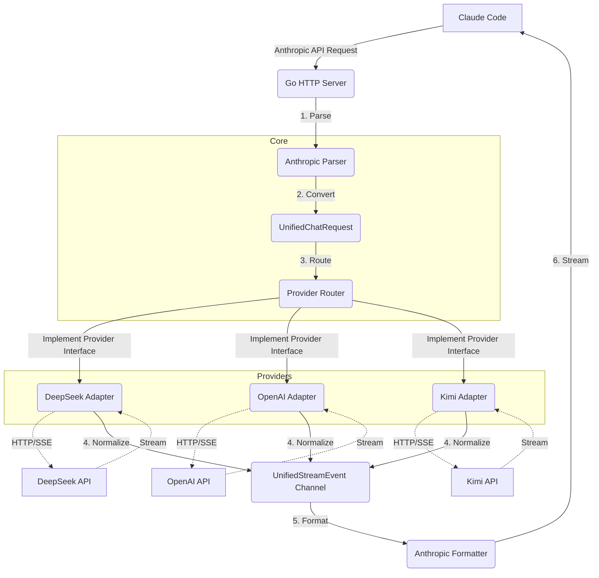

# DeepClaude Go Architecture

## Background & Motivation
The existing Node.js proxy is slow, buffers requests unnecessarily, and struggles with the varied API formats of different LLM providers. To build a highly-performant, open-source proxy for Claude Code, we are rewriting the tool in **Go (Golang)**. 

The core innovation is a **Unified Protocol Architecture**. Instead of translating Anthropic requests directly into every possible provider format, the core proxy translates the inbound Anthropic request into a single `UnifiedChatRequest` struct. Provider packages then implement a standardized `Provider` interface, translating this unified structure into their specific outbound format and streaming back `UnifiedStreamEvent`s.

## Architecture Diagram



## Key Components

### 1. The Core Data Structures (`internal/types`)
- `UnifiedChatRequest`: Represents a normalized request, including system prompts, chat history, temperature, tools, and max tokens.
- `UnifiedStreamEvent`: Represents a normalized streaming event (e.g., token generation, thinking blocks, tool calls, finish reasons).

### 2. The Provider Interface (`internal/providers`)
```go
type Provider interface {
    // StreamChat takes a unified request and returns a channel of unified events
    StreamChat(ctx context.Context, req *types.UnifiedChatRequest) (<-chan types.UnifiedStreamEvent, error)
}
```

### 3. The Front Door (`internal/server`)
- Fast HTTP router (e.g., `net/http` or `chi`) handling the `/v1/messages` endpoint.
- Validates Anthropic headers (OAuth for bridge, API keys for providers).
- Handles graceful shutdown and CORS.

### 4. Translators (`internal/translators`)
- **AnthropicIn**: Converts incoming Anthropic HTTP requests to `UnifiedChatRequest`.
- **AnthropicOut**: Converts `UnifiedStreamEvent` channels into outbound Anthropic SSE HTTP streams.

## Implementation Plan (Phased Approach)

### Phase 1: Core Scaffolding
- Set up Go module (`github.com/yourusername/deepclaude`).
- Define the `UnifiedChatRequest` and `UnifiedStreamEvent` structs.
- Define the `Provider` interface.

### Phase 2: Anthropic Engine
- Implement the HTTP server and routing.
- Implement the `AnthropicIn` parser.
- Implement the `AnthropicOut` SSE formatter, specifically handling token usage counting which Claude Code strictly requires.

### Phase 3: Initial Providers
- Implement the **DeepSeek** provider adapter (translating Unified -> DeepSeek API -> Unified).
- Implement the generic **OpenAI-compatible** adapter.

### Phase 4: CLI & Configuration
- Build the CLI entry point using `cobra` or standard `flag`.
- Environment variable parsing and basic logging (`slog`).

## Verification & Testing
- Unit tests for the `AnthropicIn` and `AnthropicOut` translators.
- Mock provider to test end-to-end streaming latency.
- Integration test running the compiled binary against a real `claude remote-control` session.
