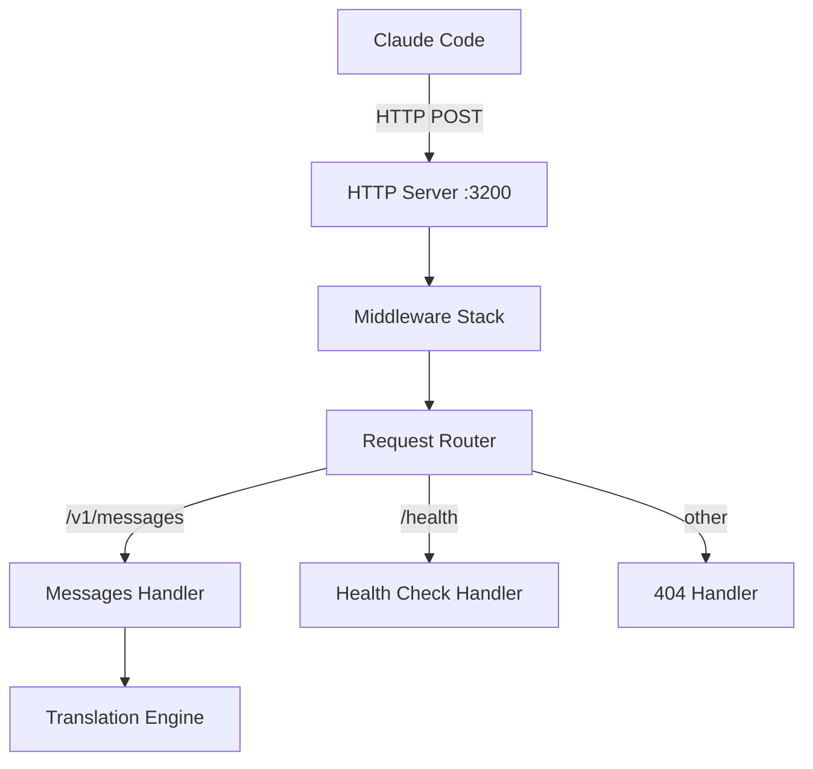

# HTTP Server - Design

## Architecture



## Components

### Server Initialization

```go
// internal/api/server.go

type Server struct {
    httpServer *http.Server
    router     *http.ServeMux
    config     *config.Config
    logger     *slog.Logger
    app        *app.App
}

func NewServer(app *app.App) *Server {
    router := http.NewServeMux()
    
    server := &Server{
        router: router,
        config: app.Config,
        logger: app.Logger,
        app:    app,
    }
    
    // Register routes
    router.HandleFunc("/v1/messages", server.handleMessages)
    router.HandleFunc("/health", server.handleHealth)
    
    // Create HTTP server
    server.httpServer = &http.Server{
        Addr:         fmt.Sprintf("%s:%d", app.Config.Host, app.Config.Port),
        Handler:      server.withMiddleware(router),
        ReadTimeout:  time.Duration(app.Config.Timeout) * time.Second,
        WriteTimeout: time.Duration(app.Config.Timeout) * time.Second,
    }
    
    return server
}

func (s *Server) Start() error {
    s.logger.Info("starting HTTP server", "addr", s.httpServer.Addr)
    
    listener, err := net.Listen("tcp", s.httpServer.Addr)
    if err != nil {
        if strings.Contains(err.Error(), "address already in use") {
            return fmt.Errorf("port %d is already in use", s.config.Port)
        }
        return fmt.Errorf("failed to bind to %s: %w", s.httpServer.Addr, err)
    }
    
    s.logger.Info("HTTP server listening", "addr", listener.Addr().String())
    
    // Serve in goroutine
    go func() {
        if err := s.httpServer.Serve(listener); err != nil && err != http.ErrServerClosed {
            s.logger.Error("HTTP server error", "error", err)
        }
    }()
    
    return nil
}
```

### Middleware Stack

```go
// internal/api/middleware.go

func (s *Server) withMiddleware(handler http.Handler) http.Handler {
    // Apply middleware in reverse order (last applied = first executed)
    handler = s.corsMiddleware(handler)
    handler = s.loggingMiddleware(handler)
    handler = s.contextMiddleware(handler)
    return handler
}

func (s *Server) contextMiddleware(next http.Handler) http.Handler {
    return http.HandlerFunc(func(w http.ResponseWriter, r *http.Request) {
        // Context is already created by http.Server
        // Just pass through
        next.ServeHTTP(w, r)
    })
}

func (s *Server) loggingMiddleware(next http.Handler) http.Handler {
    return http.HandlerFunc(func(w http.ResponseWriter, r *http.Request) {
        start := time.Now()
        
        // Wrap response writer to capture status code
        wrapped := &responseWriter{ResponseWriter: w, statusCode: http.StatusOK}
        
        next.ServeHTTP(wrapped, r)
        
        duration := time.Since(start)
        
        s.logger.Info("request completed",
            "method", r.Method,
            "path", r.URL.Path,
            "status", wrapped.statusCode,
            "duration_ms", duration.Milliseconds(),
        )
    })
}

func (s *Server) corsMiddleware(next http.Handler) http.Handler {
    return http.HandlerFunc(func(w http.ResponseWriter, r *http.Request) {
        origin := s.config.CORSOrigin
        if origin == "" {
            origin = "*"
        }
        
        w.Header().Set("Access-Control-Allow-Origin", origin)
        w.Header().Set("Access-Control-Allow-Methods", "POST, GET, OPTIONS")
        w.Header().Set("Access-Control-Allow-Headers", "Content-Type, Authorization")
        w.Header().Set("Access-Control-Max-Age", "86400")
        
        // Handle preflight
        if r.Method == "OPTIONS" {
            w.WriteHeader(http.StatusOK)
            return
        }
        
        next.ServeHTTP(w, r)
    })
}

type responseWriter struct {
    http.ResponseWriter
    statusCode int
}

func (rw *responseWriter) WriteHeader(code int) {
    rw.statusCode = code
    rw.ResponseWriter.WriteHeader(code)
}
```

### Request Handlers

```go
// internal/api/handlers.go

func (s *Server) handleMessages(w http.ResponseWriter, r *http.Request) {
    if r.Method != "POST" {
        http.Error(w, "Method not allowed", http.StatusMethodNotAllowed)
        return
    }
    
    // Parse Anthropic request
    parser := translator.NewAnthropicInParser(s.logger)
    unifiedReq, err := parser.Parse(r.Body)
    if err != nil {
        s.logger.Error("failed to parse request", "error", err)
        http.Error(w, fmt.Sprintf("Invalid request: %v", err), http.StatusBadRequest)
        return
    }
    
    // Get provider adapter
    provider, err := s.app.Registry.Get(s.config.ActiveProvider)
    if err != nil {
        s.logger.Error("provider not found", "provider", s.config.ActiveProvider, "error", err)
        http.Error(w, fmt.Sprintf("Provider error: %v", err), http.StatusInternalServerError)
        return
    }
    
    // Stream chat
    eventChan, err := provider.StreamChat(r.Context(), unifiedReq)
    if err != nil {
        s.logger.Error("provider stream failed", "error", err)
        http.Error(w, fmt.Sprintf("Provider error: %v", err), http.StatusBadGateway)
        return
    }
    
    // Format and stream response
    formatter := translator.NewAnthropicOutFormatter(s.logger)
    if err := formatter.StreamToWriter(r.Context(), w, eventChan); err != nil {
        s.logger.Error("failed to stream response", "error", err)
        return
    }
}
```

### Health Check Handler

```go
// internal/api/health.go

type HealthResponse struct {
    Status   string `json:"status"`
    Provider string `json:"provider"`
    Version  string `json:"version"`
}

func (s *Server) handleHealth(w http.ResponseWriter, r *http.Request) {
    if r.Method != "GET" {
        http.Error(w, "Method not allowed", http.StatusMethodNotAllowed)
        return
    }
    
    response := HealthResponse{
        Status:   "ok",
        Provider: s.config.ActiveProvider,
        Version:  version.Version,
    }
    
    w.Header().Set("Content-Type", "application/json")
    w.WriteHeader(http.StatusOK)
    json.NewEncoder(w).Encode(response)
}
```

### Graceful Shutdown

```go
// internal/api/server.go

func (s *Server) Shutdown(ctx context.Context) error {
    s.logger.Info("shutting down HTTP server")
    
    // Create shutdown context with timeout
    shutdownCtx, cancel := context.WithTimeout(ctx, 30*time.Second)
    defer cancel()
    
    // Shutdown server
    if err := s.httpServer.Shutdown(shutdownCtx); err != nil {
        s.logger.Error("HTTP server shutdown error", "error", err)
        return err
    }
    
    s.logger.Info("HTTP server shutdown complete")
    return nil
}
```

## Performance Considerations

### HTTP/2 Support
HTTP/2 is automatically enabled in Go 1.6+ when using TLS. For local development without TLS, HTTP/1.1 is used with connection reuse.

### Connection Pooling
The server reuses TCP connections for multiple requests from Claude Code, reducing connection overhead.

### Timeout Configuration
- **ReadTimeout**: Maximum time to read request (default: 300s)
- **WriteTimeout**: Maximum time to write response (default: 300s)
- Both apply to the entire request lifecycle including streaming

## Error Handling

### Port Conflict
```go
if strings.Contains(err.Error(), "address already in use") {
    return fmt.Errorf("port %d is already in use", s.config.Port)
}
```

### Request Timeout
```go
if ctx.Err() == context.DeadlineExceeded {
    http.Error(w, "Request timeout", http.StatusGatewayTimeout)
    return
}
```

### Invalid Route
```go
// Default handler for unmatched routes
router.HandleFunc("/", func(w http.ResponseWriter, r *http.Request) {
    http.Error(w, "Not found", http.StatusNotFound)
})
```
