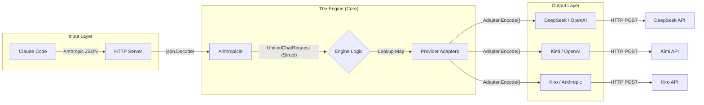

# New DeepClaude Architecture - Part 1: Communication Protocol

This document outlines the first layer of the new Go-based DeepClaude architecture.

## 1. The Entry Point: HTTP + JSON

Claude Code interacts with the proxy via the standard Anthropic Messages API. This is the "Front Door" of our application.

### Protocol Characteristics
*   **Transport:** HTTP/1.1 or HTTP/2
*   **Method:** `POST`
*   **Endpoint:** `/v1/messages` (Intercepted via `ANTHROPIC_BASE_URL`)
*   **Payload Format:** `application/json`
*   **Streaming:** `text/event-stream` (SSE)

### The Request Flow
1.  **Incoming Request:** Claude Code sends an HTTP POST request to the proxy.
2.  **Zero-Buffer Parsing:** The Go proxy uses `json.NewDecoder(r.Body)` to parse the incoming JSON bytes directly into the `UnifiedChatRequest` struct.
    *   *Advantage:* No memory is wasted storing the entire request body as a string.
3.  **Header Management:**
    *   The proxy captures the `Authorization` or `x-api-key` headers if present.
    *   It identifies the target mode (e.g., DeepSeek, Kimi) based on CLI flags or session state.

### Initial Data Mapping (The "Unified" Stage)
The incoming JSON is immediately normalized into our internal Go structures:
- **Model Mapping:** `claude-3-7-sonnet` → `[Provider Specific Model]`
- **Message Normalization:** Converts Anthropic's content block array into a simplified internal format.
- **Tool Normalization:** Extracts tool definitions for providers that support function calling.

## 2. The Universal Translator Engine

The core of the system is a high-speed translation pipeline that acts as an abstraction layer between Claude Code and the LLM providers.

### Transformation Flow Diagram

### The Transformation Pipeline
1.  **Ingestion (Anthropic → Unified):**
    *   The `AnthropicIn` module decodes the incoming Anthropic JSON into the binary `UnifiedChatRequest` Go struct.
2.  **Strategic Routing (The Provider Map):**
    *   The engine uses a lookup map to select the correct **Provider Adapter**.
    *   *Example:* If the user selects `--mode deepseek`, the engine retrieves the DeepSeek adapter which contains the specific logic for that provider's API endpoint and format.
3.  **Outbound Translation (Unified → Provider Native):**
    *   The selected adapter takes the `UnifiedChatRequest` and encodes it into the target format (e.g., OpenAI Chat Completions for DeepSeek/Kimi).
    *   The adapter initiates the outbound HTTP request to the provider.

### Why a "Unified" Engine?
*   **Decoupling:** The "Front Door" (Anthropic API) never needs to know the details of the "Back Door" (DeepSeek/Kimi API).
*   **Scalability:** Adding a new provider only requires adding a new adapter to the map, rather than rewriting the server logic.
*   **Performance:** Go's ability to handle these translations in memory (binary structs) ensures that the "engine" adds sub-millisecond overhead to the overall request.

---
*Next: Part 3 will detail the Streaming Pipeline (SSE) and Token Usage Normalization.*
